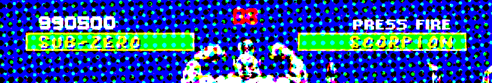
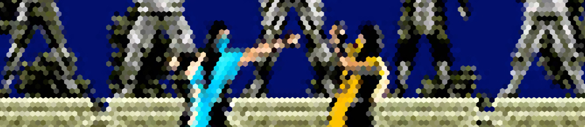
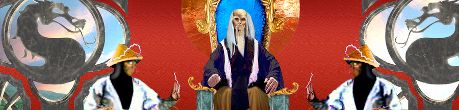
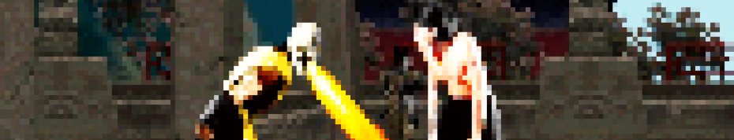
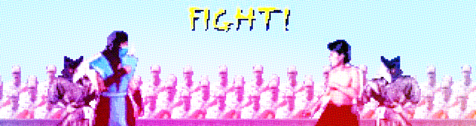
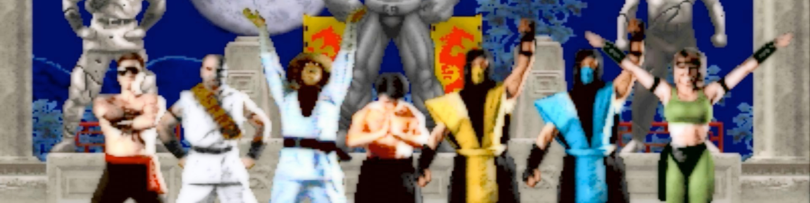

# :speak_no_evil: Weak CSS

status: **draft**



Weak CSS is methodology and naming convention for HTML and CSS classes which prioritize weak
[specificity](http://cssspecificity.com/) over complex selectors so styles won't fight you.
To some degree it's based on [BEM](http://getbem.com/) philosophy even though one might see
similarities with [OOCSS](http://oocss.org/) as well.

Weak CSS prefers BEM's determinism and OOCSS's modularity but takes both on different level.
In Weak CSS we're not talking about *Block, Element and Modifier* but rather about
**Namespaced Module, Element Path and its State**. It's designed to be used with
**CSS pre-processors** like [SASS](http://sass-lang.com/) and prefers **declarative views** layer
similar to [elm-lang/html](http://package.elm-lang.org/packages/elm-lang/html/latest) even though
its principals can be applied regardless of technology used.

## :ok_hand: Philosophy is Based on:

- :point_right: **Concern separation** - *HTML describes what no how*
- :point_right: **Determinism** - *Styles contains whole information about rules applied*
- :point_right: **Avoiding Globals** - *Namespaces over global names*
- :point_right: **Equality** - *"Nested" rules have same specificity as top ones*
- :point_right: **Maintainability** - *Following all previous rules this is ultimate goal you have for free*

**This document is in state of draft and might change rapidly over time.**

## :mask: Disclaimer

Practices described bellow comes from our experiences with building web based applications using web technologies.
By any mean this is not attempt to either enforce or convince anyone follow any of this advice.
We strongly believe in everyone's or any group's right to chose or deny any practice they wish.
We hope all potential adoptions of rules described within this document will be motivated by
democratic agreement of people imposed to follow them.

## :wave: Introduction



CSS are way too complex. Not necessary complex learn or to understand but complex to reason about.
Given some set of rules it's really hard to tell what actual result will look like since
many rules can be mixed together each with different specificity. Especially in growing systems
this complexity can reach the point of very high maintenance cost quickly.

BEM methodology is nice solution to this problem however not every UI is really composed with
Block, Element and modifier. From our experience pure BEM can lead to real explosion of
names on Element level namespace especially in applications where UI seems to be rather nested
than listed.

## :point_up: Basic Rules



This is list of the most important rules to follow.

### :fist: Only style.scss filename is allowed for definitions containing rules.

Only `style.scss` and similar (eg. `styles.scss` if you want) is allowed as filename for styles. Weak CSS are focused on nesting.
For instance if your project's source code lives in `src` directory and contains `App` and `Menu` module
your styles should live in `src/style.scss` - containing only app styles and `@import ./Menu/style.scss` and `src/Menu/style.scss`.

### :grimacing: Reuse can be done only via @mixins and $variables.

Don't mix class names in view layer to compose different rules. All reuse should be done on CSS level itself.
You can have file like `utilities.scss`, `mixins.scss` or `variables.scss` as long as this file do not contain
any direct rules.

### :point_up: Only class selectors can be used in styles.

Don't use ids and tag names. Styling tags can be useful only to style content provided by user if he/she is
able to provide Html template in your system. Even then these rules should be namespaced to element containing this
logic.

### :open_hands:  Everything is namespaced by module.

The very top rule is definition of module rule. This is defined by class like `.menu`. Similarly to BEM namespace
and elements are usually separated by `__`. This means that `list` within menu has selector like `.menu__list`.
**Namespace is always same as module name**. If your styles live in `Menu/style.scss` namespace is `menu`.
If styles live in `Post/Show/style.scss` namespace should be `post__show`.

### :hand: All mixins and variables are defined within file or file explicitly imported.

Don't use variables defined in parent. Ideally you can also define also variables only in namespace like:

```scss
.menu {
    $text-color: black;
    ....
}
```

If you need to reuse any variable or mixin put these in separate file and use explicit import on all places needed.
This will help you with reduce of redundant code. It's easier to add code than to remove it.

### :raised_hands: Element classes can be nested by prefixes.

Within module namespace element rules are defined. Those elements can be nested using `--` separator like:

```css
.menu {}
.menu__list {}
.menu__list--item {}
```

In SCSS (or Sass if you with) this can be written as follows:

```scss
.menu {
    ...
    &__list {
        ...
        &--item {
            ...
        }
    }
}
```

**There it's allowed to use mixins and variables defined in upper scope!**

### :beers: Sub-module shouldn't depend on it's parent.

Sub-Module should be independent on it's parent. It's a parent that has dependency on its children (via `@import`s)
no other way around. This helps you to separate concerns and make smaller pieces easier to abstract, reuse or separate in future.

### :wink: State is secondary class name.

The only higher specificity selectors are one containing state indicator. State unlike element selector is simple descriptive class name.
States are always used together with original selector in styles like:

```scss
.menu__list--item {}
.menu__list--item.active {}
```

or in SCSS:

```scss
.menu__list--item {
    ...
    &.active {
        ...
    }
}
```

You can think about them as about your own extension to selectors like `:active`, `:focused` and similar.
States can be combined if needed.

### :exclamation: Don't use !important.

Seriously, don't.

### :ok_hand: Mixins are always first.

Mixins should be defined before any rule. You don't want to hide fact that mixin is overwriting direct rule, do you?

### :heart: Be nice while enforcing any of these rules!

This is really important rule. Weak CSS tries to make everyone's life a bit easier not worst.
If you feel someone did something badly never use this document as tool for punishing them.
Remember your own mistakes. Folks also have their right to disagree with these or any other rules.
Being nice and opened doesn't mean you have to buy everything. Please keep all discussion on constructive
level yourself and then expect other to follow your example.

## :question:  Additional Rules to Consider



There are few more additional rules that can be applied. Usually it's good to enforce those once project itself
spawn spike or MVP phase and maintainability becomes primary concern.

### :see_no_evil: Isolation over DRY.

Many similarities in UI are just accidental. In first version A and B maybe has same color and font but will it have same in next version?
It's always safer to choose isolation over reuse. With too much reuse can you be really sure you're not touching something you don't want to touch?
How much of the reused rules will become overwritten in all places over time?

### :hear_no_evil: Avoid Global Rules.

Don't use rules on global level. Globals are really hard to change later and might generate tons of redundant code over time.

### :monkey: Limit z-indexes.

Order in view level matters anyway. Don't be afraid to use it to deal with layering! Z-indexes can be really painful when there
is too much of them. Can you really thing about all combinations them? In larger app hardly. Question every z-index used.

### :confused: Properties which affect layout calculation should be first.

We don't like ideas of ordering css properties alphabetically. Instead we're in favour of putting most important -
Ones which affects other elements or layout itself first. This means `display`, `position` or `width`
should be always before `color`, `border-radius` or `font-style`.

### :alien: No reset styles

Do you really know what all your resets are doing? How much will you be afraid to change or delete them in year or two from now?

## :construction_worker: Example



Following example is written in SCSS and demonstrates how more feature complete implementation can look like.

```scss
// src/Dialogs/style.scss

.dialogs {
    $color-bg: #7c2494;
    $border-radius: 5px;

    position: absolute;
    width: 350px;
    height: auto;
    top: calc(50% - 175px);
    left: calc(50% - 175px);
    padding: 0;
    border-radius: $border-radius;
    color: #fff;
    background: $color-bg;
    // rocket launcher here
    z-index: 100;

    &__header {
        position: relative;
        height: 60px;
        line-height: 60px;
        padding: 0 20px;
        background: #410851;
        border-top-left-radius: $border-radius;
        border-top-right-radius: $border-radius;

        &--close {
            position: absolute;
            top: 0;
            right: 20px;
            bottom: auto;
            left: auto;
            padding: 0;
            line-height: 60px;
            font-size: 23px;
            color: #fff;
            opacity: 0.6;
        }
    }

    &__body {
        margin: 30px 0 20px 0;
        padding: 0 20px;
        font-size: 14px;
    }

    &__buttons {
        padding-left: 20px;

        @mixin button {
            padding: 7px 20px;
            margin-bottom: 30px;
            margin-right: 5px;
            border-radius: 50px;
            border: 2px solid #fff;
        }

        &--no {
            @include button;

            color: #fff;
        }

        &--yes {
            @include button;

            color: $color-bg;
            background: #fff;
        }
    }
}

```

## :point_left: Links


Link on additional tools and resources

### Elm abstraction for working with Weak CSS styles

[class-namespaces](https://github.com/GlobalWebIndex/class-namespaces) is our in-house library based on ideas described in this document
released under BSD-3-Cause license. It's our preferable implementation for view logic in Elm.

### Side-Effects in CSS

is [Philip Walton's article describing problems with CSS](https://philipwalton.com/articles/side-effects-in-css/). Author prefers BEM
as solution for problems he describes but we still consider this to be really high quality resource about this topic.

## :raised_hands:  Final Thoughts



As with all "best practices" never stop questioning values/costs and their impact on your work. Following rules
which doesn't make sense anymore or don't really fit your needs is maybe worse than having no rules at all.
